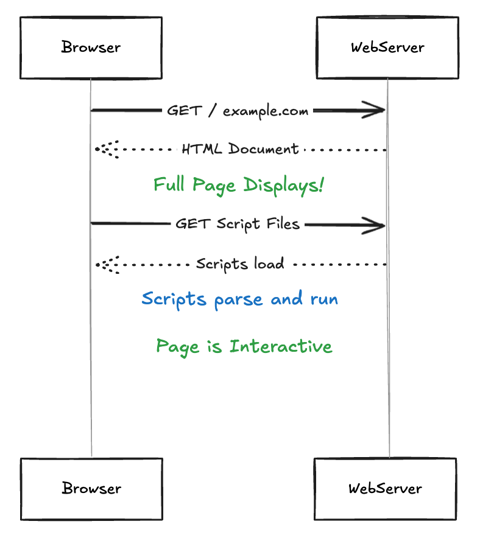

# Course Introduction

Hi, I'm Adam, and welcome to my TanStack Start Workshop!

The repo for this course is the top pin at [https://github.com/arackaf/fm-tanstack-workshop](https://github.com/arackaf/fm-tanstack-workshop)

## Course requirements

- None (maybe)

By default this project will run against an in-memory Postgres database. On startup the database schema, and some initial data will be inserted for you, before the application starts.

Just clone the repo, `npm i`, and `npm run dev`

This means every time you stop, and restart the dev server, any data you've added or changed will be reverted.

If you'd prefer to have a persistent database, that's set up here as well, you just need to have Docker running on your machine.

Running the project with a persistent database:

- clone the repo
- npm i
- Start Docker Desktop
- Run `npm run pg`
- Open a NEW terminal and run `npm run dev`
- Browse to localhost:3000

## What is TanStack Start ... and Router

TanStack Router - [docs](https://tanstack.com/router/latest/docs/overview)
TanStack Start - [docs](https://tanstack.com/start/latest)

Router is an incredibly flexible, strongly typed JavaScript framework. Router will give you a JavaScript-driven single page application (SPA).

Start takes Router, and adds server support.

### Server support

- Server side rendering (SSR)
- Server Functions (and middleware)
- API endpoints

Even if you don't care about SSR, you'll probably need somewhere to run server-side code, and Start provides that.

If you truly don't care about SSR, and you truly just want a 100% client-driven SPA that soley calls backend services you have elsewhere, ok just use Router; hosting the resulting application will be as simple as throwing the build artifacts onto a CDN.

### Why SSR

With a normal SPA, the browser renders an empty application shell, likely with a loading spinner. That means, when the server responds to the url the user put into their browser, they see this


What happens then?


What if, instead of rendering an empty application shell, we rendered ... the actual page?



Which looks like this


SSR (with a framework like React) is usually (for reasons we won't get into) tricky to get right. But TanStack Start handles this for you.

## Using TanStack Start

We'll be exclusively using Start, here. Every bit of the route definitions, navigations, route loading and layouts are purely TanStack Router. Start just adds SSR, and the ability to run code on the server.

But we'll always be using Start.

### Quick start

To scaffold a fresh TanStack Start application

```
npm create @tanstack/start@latest
```

## Our app

Run this repo, and then navigate to localhost:3000/app

That's the proof of concept for this application. It's somewhat realistic, and should give you a decent taste of actually using TanStack Start for something real.

For this workshop, we'll be focusing on contrived exercises that re-create simplified portions of certain features.

## Struture of the src folder

- components folder has various react components (duh)
  - I purposefully kept the routes as minimal as possible (just render components from here)
- data folder contains all data access code (Drizzle)
  - I purposefully kept all server functions as minimal as possible (single call to a method here)
- drizzle folder contains the Drizzle schema and migration metadata
- routes us where all the TanStack routes live
- server-functions is where all my server functions live
  - This helped keep route files uncluttered and minimal

You do **NOT** (and likely should not) keep everything quite so obsessively separated. I did that to help focus our attention where it's needed. Rather than a long Drizzle db query chain, you just see a call to a function that executes that query. If you're curious what the query looks like you're of course free to command-click into it, but otherwise it should help remove distractions

## Quick Drizzle Demo

Step 1: Create your Database
Step 2: Create a drizzle.config.js
Step 3: npx drizzle-kit generate
Step 4: Set up your connection
Step 5: Profit

If you ever choose to update the database, you can sync the Drizzle schema and relations files with `npx drizzle-kit pull`
