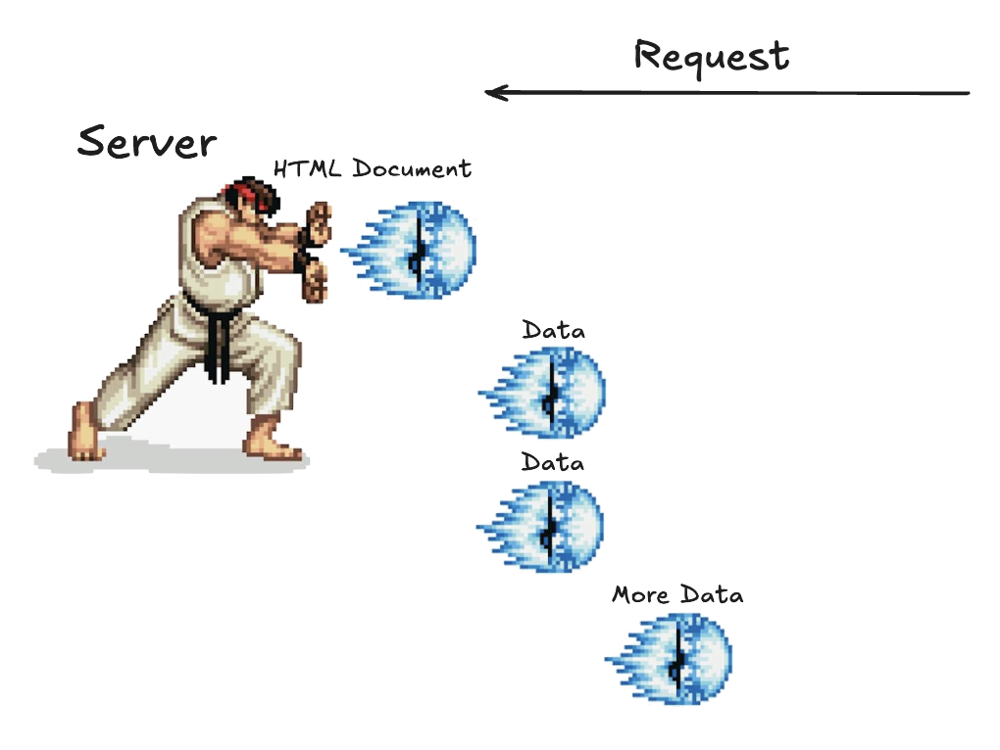

# Streaming

## Objectives

- Stream data

## The one tradeoff with ssr

We talked about the SPA tradeoff. It sucked when the user browsed to our app and saw this

This happened before our initial render only, essentially, rendered a shell for our app with a loading spinner.

It rendered this quickly, for sure, but the requests for data did not happen until that initial response was received, and our browser parsed, and executed our javascript. Only then did our requests for data fire.

SSR is cool because instead of a loading spinner, our browser renders full content from that initial response.

## What are we assuming though?

